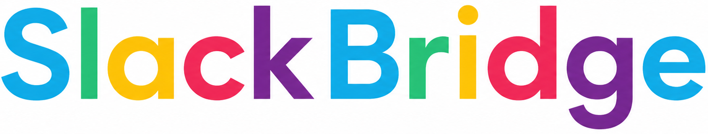

# Slack Bridge

<p>
  
</p>

Slack Bridge is an internal event-to-Slack gateway. It turns application events into structured Slack messages without adding Slack-specific code to every project.

Apps send events to one central API. Slack Bridge handles authentication, template rendering, routing to the configured Slack webhook, delivery, usage tracking, and event logging.

## Why Slack Bridge?

Slack notifications across multiple systems often become inconsistent and hard to maintain:

- duplicated Slack integration logic
- different message formats in every app
- abandoned "nice-to-have" notifications
- no central audit trail when delivery fails

Slack Bridge gives teams a single configurable gateway for event-driven internal messaging.

## How It Works

```text
Your App -> Slack Bridge API -> Scriban Template -> Slack Incoming Webhook
```

1. An application sends an event such as `user_signup` or `payment_received`.
2. Slack Bridge authenticates the request with a project API key.
3. The event key is matched to an `EventDefinition` for the API key's project.
4. The configured Scriban template is rendered with the event data.
5. The rendered message is posted to the project's Slack webhook, unless the event definition has its optional webhook override enabled.
6. Success or failure is written to `EventLogs`.

## Example

Request:

```http
POST /api/events
x-api-key: sb_your_project_key
Content-Type: application/json
```

```json
{
  "key": "user_signup",
  "data": {
    "email": "user@example.com",
    "plan": "pro"
  }
}
```

Template:

```scriban
New signup!
Email: {{ email }}
Plan: {{ plan }}
```

Slack message:

```text
New signup!
Email: user@example.com
Plan: pro
```

## Features

- API key authentication per project
- Hashed API key storage
- Configurable projects, API keys, and event definitions
- Dynamic Scriban message templates
- Project-level Slack Incoming Webhook delivery
- Optional event-level Slack webhook override, disabled by default
- Razor Pages admin dashboard
- ASP.NET Core Identity login/logout and first-admin setup
- Admin and Member roles
- Event logs for debugging and traceability
- Monthly usage tracking
- Local plan enforcement for Free, Pro, and Scale plans
- Background retry worker for failed Slack deliveries
- Single-tenant customer instance model, ready to evolve toward multi-tenancy

## Tech Stack

- .NET 9 / ASP.NET Core
- Razor Pages and Web API controllers
- ASP.NET Core Identity
- Entity Framework Core
- SQL Server
- Scriban
- Slack Incoming Webhooks

Stripe is intentionally skipped for now. Billing is represented by a local `Subscription` record behind `IBillingService`, so Stripe Checkout and webhooks can be added later without changing the event ingestion pipeline.

## Architecture

Slack Bridge is a modular monolith. The web app contains the API, admin UI, Identity, persistence, and background worker in one deployable unit.

Core services:

- `ISlackService` posts rendered messages to Slack.
- `ITemplateService` renders Scriban templates from arbitrary JSON.
- `IApiKeyValidator` validates hashed API keys.
- `IEventIngestionService` coordinates event handling.
- `IEventLogService` writes delivery logs.
- `IUsageService` tracks monthly usage and enforces limits.
- `IBillingService` manages the local subscription record.
- `FailedSlackRetryWorker` retries failed Slack sends.

Single-tenancy is explicit through `CustomerInstanceId`. Today each deployment uses one customer instance. Later, the same shape can become true multi-tenancy with scoped queries and tenant resolution.

## Project Structure

```text
SlackBridge.Web/
  Controllers/
    EventsController.cs
  Contracts/
    EventRequest.cs
    EventResponse.cs
  Data/
    SlackBridgeDbContext.cs
    Migrations/
  Models/
    ApplicationUser.cs
    ApiKey.cs
    CustomerInstance.cs
    EventDefinition.cs
    EventLog.cs
    EventLogStatus.cs
    PlanType.cs
    Project.cs
    RetryState.cs
    Subscription.cs
    UsageMetric.cs
  Pages/
    Account/
    Admin/
      ApiKeys/
      Billing/
      EventDefinitions/
      Logs/
      Projects/
      Usage/
  Services/
    ApiKeyGenerator.cs
    ApiKeyValidator.cs
    BillingService.cs
    CustomerInstanceContext.cs
    EventIngestionService.cs
    EventLogService.cs
    FailedSlackRetryWorker.cs
    PlanLimits.cs
    SlackService.cs
    TemplateService.cs
    UsageService.cs
```

## Run Locally

```powershell
dotnet restore
dotnet ef database update --project SlackBridge.Web --startup-project SlackBridge.Web
dotnet run --project SlackBridge.Web
```

The default connection string uses SQL Server LocalDB and creates a `SlackBridge` database.

Open the setup page after first run:

```text
http://localhost:5019/Account/Register
```

Create the first admin user, then open **Projects** and configure:

1. A project with a Slack webhook URL
2. An API key inside that project
3. Event definitions inside that project
4. Scriban templates for those events

Event definitions use the project Slack webhook by default. Enable the event-level custom webhook only when one event must route to a different Slack destination.

## Plans

Plan enforcement is local for now:

- Free: 500 events/month, 2 API keys, 1 project
- Pro: 25,000 events/month, 20 API keys, 25 projects
- Scale: 250,000 events/month, 100 API keys, 250 projects

The billing page updates the local subscription plan. Stripe integration can be added later behind `IBillingService`.

## Use Cases

- New user signups
- Payments and billing events
- System alerts
- Admin notifications
- Internal product analytics
- CI/CD and deployment updates

## Roadmap

- Slack Bot support via `chat.postMessage`
- Multi-channel routing rules
- Rich Slack Block Kit templates
- Plugin system for Email, Discord, and generic webhooks
- Stripe Checkout and subscription webhooks
- Multi-tenant hosting model

## Philosophy

Make useful notifications easy enough that teams actually keep them.
